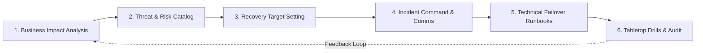

# Business Continuity in a Box (BCP-in-a-Box)

A turn-key, modular operational resilience and disaster recovery framework designed for startups, high-growth tech platforms, fintechs, and regulated entities. Aligns directly with **ISO 22301 (Business Continuity Management)**, **APRA CPS 230 (Operational Risk Management & Critical Operations)**, and **SOC 2 Trust Services Criteria (Availability & CC9.1)**.

---

## 1. When to Use This Skill

Activate this skill when:
- Establishing a complete Business Continuity & Disaster Recovery (BC/DR) program from scratch for a product or company.
- Conducting a **Business Impact Analysis (BIA)** to identify Critical Business Functions (CBFs), Maximum Tolerable Downtime (MTD), Recovery Time Objectives (RTO), and Recovery Point Objectives (RPO).
- Designing **Incident Command Systems (ICS)** and emergency communications call trees.
- Authoring technical **Disaster Recovery (DR) and Failover Runbooks** for multi-region cloud infrastructure, databases, and third-party API dependencies.
- Facilitating **Tabletop Simulation Exercises** (cloud outages, ransomware, vendor collapses, key person loss) and generating remediation scorecards.
- Auditing regulatory compliance under APRA CPS 230, ISO 22301, or SOC 2 Type II audit preparations.

---

## 2. Core Architecture & Resiliency Tiers

Business continuity categorizes all operations into four discrete recovery tiers based on business and regulatory impact:

| Criticality Tier | Target Classification | Maximum Tolerable Downtime (MTD) | Recovery Time Objective (RTO) | Recovery Point Objective (RPO) | Resiliency Strategy |
| :--- | :--- | :--- | :--- | :--- | :--- |
| **Tier 0: Mission-Critical** | Customer transactions, live API, identity verification, auth | $\le 1\text{ hour}$ | $\le 15\text{ minutes}$ | $\le 5\text{ minutes}$ | Multi-AZ / Multi-Region active-active or hot standby, automated health-check failover |
| **Tier 1: Core Business** | Customer onboarding, billing dispatch, core database read/write | $\le 4\text{ hours}$ | $\le 1\text{ hour}$ | $\le 15\text{ minutes}$ | Warm standby, cross-region asynchronous replication, automated snapshot restore |
| **Tier 2: Important** | Batch compliance syncing, analytics, admin backoffice portals | $\le 24\text{ hours}$ | $\le 4\text{ hours}$ | $\le 1\text{ hour}$ | Automated container redeployment via IaC (Terraform/CloudFormation), daily cold snapshots |
| **Tier 3: Deferred** | Internal BI reporting, marketing websites, non-urgent support | $\le 72\text{ hours}$ | $\le 24\text{ hours}$ | $\le 24\text{ hours}$ | Standard redeploy from Git repository, restore from archival backups |

---

## 3. The 6-Phase Turn-Key Execution Workflow



### Phase 1: Business Impact Analysis (BIA)
- Identify all services, processes, and assets.
- Classify into **Critical Business Functions (CBFs)**.
- Quantify financial loss per hour, customer churn risk, reputational damage, and statutory regulatory fines (e.g. AUSTRAC, APRA, ASIC, GDPR).
- Map hard dependencies: Upstream inputs, downstream dependents, software vendors, and physical/human requirements.
- Reference guide: [business-impact-analysis-template.md](file:///Users/harishabib/code/github/haris-admin/skills-rules-repo/compliance/business-continuity-in-a-box/references/business-impact-analysis-template.md).

### Phase 2: Threat & Risk Assessment
- Catalog plausible disaster vectors:
  1. *Infrastructure Failure*: AWS/Azure region outage, DNS failure, CDN edge routing collapse.
  2. *Cyber Incident*: Ransomware attack, credential compromise, distributed denial of service (DDoS).
  3. *Vendor / Third-Party Outage*: ASIC API outage, payment gateway failure, LLM provider downtime.
  4. *Human Factor*: Key person departure or sudden incapacitation, distributed team internet loss.
  5. *Data Corruption*: Malicious drop, erroneous DB migration, zero-day bug corruption.

### Phase 3: Recovery Strategy Formulation
- Enforce the golden rule: **$\text{RTO} \le \text{MTD}$** and **$\text{RPO} \le \text{Maximum Tolerable Data Loss}$**.
- Define technical resilience patterns: Active-active, warm standby with pilot light, or automated container rebuild from immutable code repositories.
- Specify manual and degraded operating modes (e.g., read-only fallback mode, asynchronous batch queuing).

### Phase 4: Incident Command System (ICS) & Call Tree
- Stand up the 4-tier Incident Command structure:
  - **Incident Commander (IC)**: Holds absolute operational decision authority during an active crisis.
  - **Technical Operations Lead**: Executes technical mitigation, failovers, and infra restoration.
  - **Communications & Customer Liaison**: Manages customer status page, regulator notifications, and executive briefings.
  - **Legal & Compliance Officer**: Evaluates mandatory breach notifications (APRA, OAIC, AUSTRAC) within legal timeframes (e.g., 72 hours for GDPR/OAIC, 24-72 hours for APRA CPS 230).
- Establish out-of-band communication channels (e.g., dedicated Signal group, hosted external Statuspage).
- Reference guide: [incident-command-and-call-tree.md](file:///Users/harishabib/code/github/haris-admin/skills-rules-repo/compliance/business-continuity-in-a-box/references/incident-command-and-call-tree.md).

### Phase 5: Technical Failover & Disaster Recovery Runbooks
- Step-by-step procedural runbooks for DNS failover, database replica promotion, secret re-keying, and cross-region traffic shifting.
- Clear criteria for declaring a disaster (e.g., outage $> 30\text{ min}$ with zero provider ETA).
- Verification checklist before switching live production traffic.
- Post-recovery graceful rollback protocol.
- Reference guide: [disaster-recovery-and-failover-runbook.md](file:///Users/harishabib/code/github/haris-admin/skills-rules-repo/compliance/business-continuity-in-a-box/references/disaster-recovery-and-failover-runbook.md).

### Phase 6: Tabletop Exercises & Continuous Audit
- Run semi-annual or annual tabletop simulation drills with cross-functional leadership.
- Execute drills using structured injects and scoring rubrics.
- Conduct Post-Incident Reviews (PIR) and maintain an immutable Corrective Action Plan (CAP) register.
- Reference guide: [tabletop-exercise-playbook.md](file:///Users/harishabib/code/github/haris-admin/skills-rules-repo/compliance/business-continuity-in-a-box/references/tabletop-exercise-playbook.md).

---

## 4. Automated Resilience Auditor CLI

Run the included resilience auditor tool to inspect service architectures, validate recovery parameters, detect single points of failure (SPOFs), and generate audit-ready scorecards:

```bash
# Run the built-in demo audit (SaaS / RegTech platform)
python3 compliance/business-continuity-in-a-box/scripts/bcp_resilience_auditor.py --demo

# Audit a custom JSON service inventory
python3 compliance/business-continuity-in-a-box/scripts/bcp_resilience_auditor.py --inventory path/to/services.json
```

---

## 5. Non-Negotiable Operational Rules

1. **RTO Must Strictly Precede MTD**: If a service has an MTD of 2 hours, its RTO must never exceed 1 hour.
2. **Untested Backups Do Not Exist**: Automated database snapshots are not considered backups until an automated restoration drill restores them into an isolated sandbox and executes integrity checks.
3. **Out-of-Band Incident Channel**: During a severe outage or compromise of primary company accounts (Google Workspace, Slack, AWS), Incident Command must convene on pre-arranged, isolated out-of-band channels (Signal / Telegram with verified hardware tokens).
4. **Separation of Comms from Remediation**: The Technical Operations Lead must never communicate with clients or regulators during the drill/incident; all messaging flows through the Communications Liaison to avoid diverting engineering focus.
5. **Annual Re-Certification**: Update BIA and service tier mappings every 6 months or immediately following any tier-0/1 architectural change.
