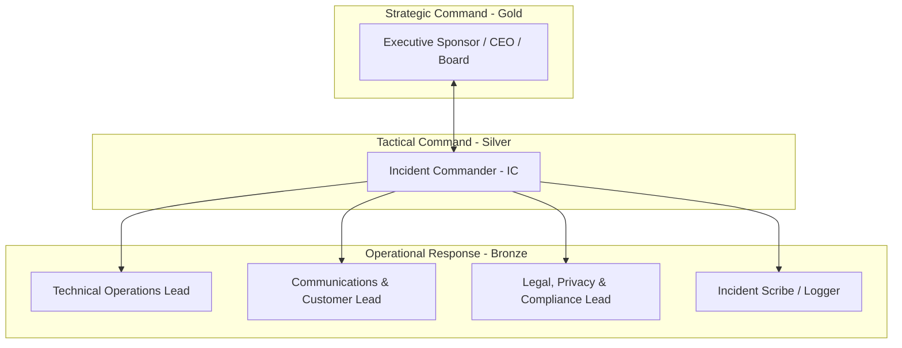

# Incident Command System (ICS) & Emergency Call Tree Protocol

A battle-tested incident management framework establishing clear command hierarchy, rapid escalation thresholds, and out-of-band communication channels during severe outages, disasters, or cyber events.

---

## 1. Incident Command Hierarchy (Gold - Silver - Bronze)



### Role Responsibilities

| Role | Primary Responsibility | Mandatory Outputs |
| :--- | :--- | :--- |
| **Incident Commander (IC)** | Holds singular decision authority; sets recovery priorities; resolves tactical trade-offs; authorizes failovers. | Disaster Declaration, SitRep broadcasts every 30 mins, Post-Incident Review signoff. |
| **Technical Operations Lead** | Directs engineering responders; executes disaster recovery runbooks; manages cloud and database failovers. | Root-cause hypothesis, technical runbook execution logs, green verification status. |
| **Communications Liaison** | Shields technical team from interruptions; drafts and publishes status page updates; notifies high-value clients. | External statuspage updates, client alert emails, support FAQ messaging. |
| **Legal & Compliance Lead** | Assesses regulatory reporting triggers (APRA CPS 230, OAIC NDB, AUSTRAC, GDPR); reviews external messaging. | Regulatory notification draft, breach assessment record, liability counsel. |
| **Incident Scribe** | Records every key decision, timestamp, metric observation, and action item in an immutable log. | Chronological Incident War Log, timeline documentation for post-mortem. |

---

## 2. Severity Classification & Escalation Triggers

| Severity Level | Definition | Impact Criteria | Activation Protocol | Status Broadcast Cadence |
| :---: | :--- | :--- | :--- | :--- |
| **SEV-1 (Critical Disaster)** | Catastrophic platform downtime or major security breach | Tier-0 CBF offline $> 15\text{ mins}$, data loss threat, ransomware, core API completely unavailable | Full ICS activation; wake-up call tree; out-of-band command bridge opened immediately | Every 15–30 minutes |
| **SEV-2 (Major Incident)** | Significant impairment of core business operations | Tier-1 CBF degraded $> 30\text{ mins}$, high error rates ($> 10\%$), redundancy lost in primary region | IC, Tech Lead, Comms Lead activated; executive sponsor alerted | Every 60 minutes |
| **SEV-3 (Moderate)** | Non-critical component failure with manual workaround | Tier-2 CBF affected, degraded background workers, single customer impacted | Standard on-call engineering triage; tickets logged | Daily or upon resolution |
| **SEV-4 (Minor)** | Cosmetic bug, internal tooling issue, minor telemetry delay | Tier-3 function, internal dashboard, zero customer impact | Business hours resolution | Standard sprint tracking |

---

## 3. Emergency Call Tree Architecture

When SEV-1 is declared, the automated paging system initiates notifications. If primary paging fails, the manual call tree activates sequentially:

```
[Monitoring Alert / Customer Escalation]
       │
       ▼
[On-Call Engineer (Tier 1)]
       │ (Unresolved after 10 mins or confirmed SEV-1)
       ▼
[Incident Commander (Primary: Engineering Director / Alternate: Head of Product)]
       │
   ┌───┴───────────────────────────────┐
   ▼                                   ▼
[Technical Ops Lead]            [Communications Lead]
   │ (Cascades to)                     │ (Cascades to)
   ├─► Infrastructure/DB Engineer      ├─► Customer Success Lead
   └─► App Security Engineer           └─► Legal/Compliance Officer
```

### Call Tree Contact Register (Template)

| Role | Primary Name | Primary Phone | Secure Messaging | Alternate Name | Alternate Phone | Alternate Channel |
| :--- | :--- | :--- | :--- | :--- | :--- | :--- |
| **Incident Commander** | Lead Architect | +61 400 111 222 | Signal: `@lead_arch` | Head of Eng | +61 400 111 333 | Signal: `@head_eng` |
| **Technical Ops Lead** | DevOps Lead | +61 400 222 333 | Signal: `@devops_lead` | Senior SRE | +61 400 222 444 | Signal: `@senior_sre` |
| **Communications Lead**| Product Manager | +61 400 333 444 | Signal: `@prod_mgr` | CS Director | +61 400 333 555 | Signal: `@cs_dir` |
| **Compliance Officer** | Head of Risk | +61 400 444 555 | Signal: `@head_risk` | Legal Counsel | +61 400 444 666 | Signal: `@legal_ext` |
| **Executive Sponsor**  | Founder / CEO | +61 400 555 666 | Signal: `@ceo_direct` | COO | +61 400 555 777 | Signal: `@coo_direct` |

---

## 4. Out-of-Band Communications Protocol

If internal corporate systems (Slack, Google Workspace, Microsoft 365, internal email) are compromised, hijacked, or offline during a crisis:

1. **War Room Channel**: All responders switch immediately to a pre-verified, private **Signal Group** (`[ORG]-P1-EMERGENCY-WAR-ROOM`).
2. **Video Conference Bridge**: Responders assemble on an external hosted meeting room (e.g. personal Zoom room or secure Jitsi instance with secondary password protection).
3. **Public Status Broadcasting**: The incident communications lead accesses the external status page (hosted on an independent third-party provider like Atlassian Statuspage or Instatus on an independent domain) using hardware security keys (YubiKey) stored outside single sign-on (SSO).
4. **Hardware Token Isolation**: Backup emergency credentials (root cloud accounts, DNS registrar, domain keys) must not be federated through the primary SSO provider that is experiencing an outage.

---

## 5. Situation Report (SitRep) Format

The Incident Commander distributes a formal Situation Report (SitRep) every 30 minutes during a SEV-1:

```markdown
**[SITREP #[N]] - [INCIDENT TITLE] - [TIMESTAMP AEST]**
- **Current Incident Status**: [Investigating / Mitigating / Restoring / Monitoring]
- **Time Since Detection**: [e.g., 47 minutes]
- **Current Business Impact**: [e.g., Screening API returning 500 errors for ~30% of requests]
- **Actions Completed Since Last SitRep**:
  - Promoted read replica in ap-southeast-2b.
  - Re-routed traffic via Cloudflare DNS to standby container cluster.
- **Immediate Next Steps (Next 30 Mins)**:
  - Verify database integrity checks.
  - Re-enable write traffic to customer tenants.
- **Blockers / Resource Needs**: [e.g., Waiting on external vendor confirmation]
- **Next SitRep Scheduled For**: [e.g., 14:30 AEST]
```
