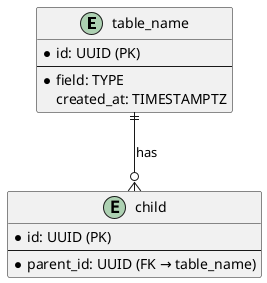

# PlantUML via Kroki API (No Java Required)

When Java/PlantUML is not installed, use the free [Kroki](https://kroki.io) API to render PlantUML diagrams as SVG.

## Pattern

```python
import requests

# PlantUML source (from architecture docs)
uml_source = """
@startuml
actor User
User -> System: Request
System -> Database: Query
@enduml
"""

# Render via Kroki
resp = requests.post(
    "https://kroki.io/plantuml/svg",
    data=uml_source.encode("utf-8"),
    headers={"Content-Type": "text/plain"},
    timeout=30,
)

if resp.status_code == 200:
    with open("diagram.svg", "wb") as f:
        f.write(resp.content)
```

## Batch Rendering from Markdown

When architecture docs contain ` ```plantuml ` blocks, extract and render them all:

```python
import re, requests, os

with open("ARCHITECTURE.md") as f:
    content = f.read()

blocks = re.findall(r'```plantuml\n(.*?)```', content, re.DOTALL)

os.makedirs("docs/diagrams", exist_ok=True)
for i, uml in enumerate(blocks):
    resp = requests.post(
        "https://kroki.io/plantuml/svg",
        data=uml.encode("utf-8"),
        headers={"Content-Type": "text/plain"},
        timeout=30,
    )
    if resp.status_code == 200:
        with open(f"docs/diagrams/diagram_{i+1}.svg", "wb") as f:
            f.write(resp.content)
        print(f"✅ diagram_{i+1}.svg ({len(resp.content)} bytes)")
```

## Supported Diagram Types

Kroki supports all major diagram formats:

| Type | Endpoint | Notes |
|------|----------|-------|
| PlantUML | `/plantuml/svg` | C4, sequence, class, ERD, activity |
| Mermaid | `/mermaid/svg` | Flowcharts, sequence, Gantt |
| C4-PlantUML | `/plantuml/svg` | Include `!include https://raw.githubusercontent.com/plantuml-stdlib/C4-PlantUML/master/C4_Container.puml` |
| D2 | `/d2/svg` | Modern alternative to PlantUML |
| GraphViz | `/graphviz/svg` | Dot graphs |

## C4 Diagram Templates

### C4 Container Diagram
```plantuml
@startuml
!include https://raw.githubusercontent.com/plantuml-stdlib/C4-PlantUML/master/C4_Container.puml
LAYOUT_WITH_LEGEND()

title Project Name — Container Diagram

Person(user, "User", "Description")
System_Boundary(sys, "System") {
    Container(web, "Web App", "React/Next.js", "UI")
    Container(api, "API", "Python FastAPI", "Business logic")
    ContainerDb(db, "Database", "PostgreSQL", "Data storage")
}
Rel(user, web, "Uses", "HTTPS")
Rel(web, api, "Calls", "JSON")
Rel(api, db, "Reads/Writes", "SQL")
@enduml
```

### Data Model (ERD)


## Pitfalls

- Kroki is a free public service — don't send sensitive data in diagrams
- For private/sensitive diagrams: install PlantUML locally instead
- SVG output is vector — scales infinitely, good for docs
- C4-PlantUML includes are fetched at render time — requires internet access
- Large diagrams may timeout (>30s) — simplify or split into multiple diagrams
